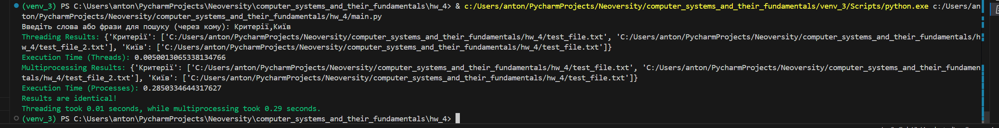

# Домашнє завдання до модуля “Конкурентність та паралелізм”
## Паралельний пошук ключових слів у текстових файлах

## Опис
Цей проєкт реалізує багатопотоковий та багатопроцесорний підходи до паралельного пошуку заданих ключових слів у текстових файлах. Програма підтримує вибір декількох `.txt` файлів та виконує пошук ключових слів одночасно у різних потоках або процесах.

## Функціонал
- Пошук ключових слів у текстових файлах з використанням багатопотокового та багатопроцесорного підходів.
- Обробка винятків при роботі з файловою системою (як-от відсутність файлу або відсутність доступу).
- Підтримка декількох файлів для пошуку.
- Автоматичне визначення кодування файлів.
- Порівняння результатів та часу виконання між двома підходами.

## Вимоги
- Python 3.11 або вище
- Встановлені залежності:
  - `colorama`
  - `chardet`
  - `concurrent.futures` (вбудована бібліотека Python)
  - `tkinter` (вбудована бібліотека Python)

Для встановлення залежностей виконайте команду:
```bash
pip install colorama chardet
......
```

## Використання
- Запустіть скрипт main.py.
- Виберіть текстові файли, які потрібно проаналізувати.
- Введіть ключові слова або фрази для пошуку через кому.
- Програма виконає паралельний пошук у кількох потоках і процесах.
- Отримаєте результати пошуку та порівняння часу виконання між двома підходами.

## Приклад запуску
```bash
python main.py
```

## Виведення результату


## Обробка винятків
- Якщо файл не існує або недоступний, програма повідомить про це червоним текстом.
- Усі помилки, пов'язані з відкриттям файлів або роботою з ними, будуть оброблені, щоб забезпечити стабільну роботу програми.